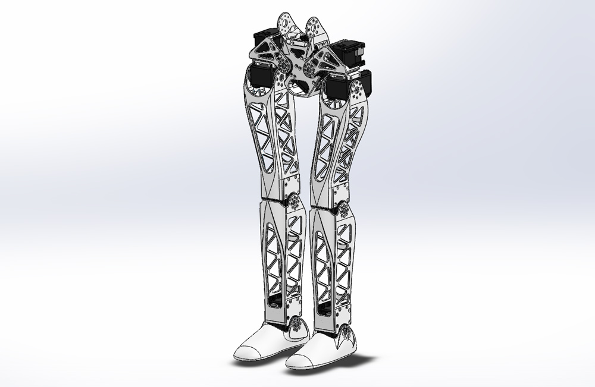
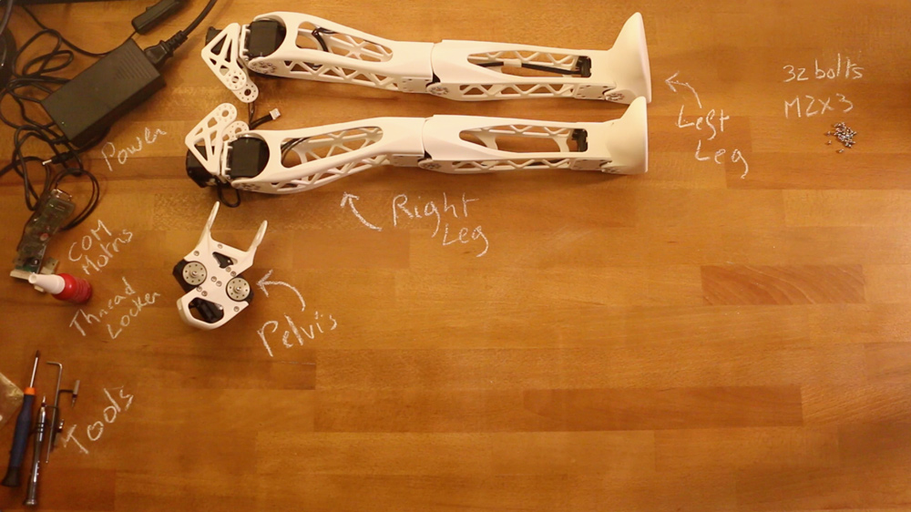

# Legs assembly instructions

## 1- Get all components required

First ensure you have all components detailed in the [Bill Of Material](BOM.md).
Also as a friendly reminder, do not forget to use threadlocker otherwise you will see your robot disassemble itself after just few weeks due to vibration.

## 2- Build sub-assemblies

First you need to assemble several sub-assemblies:
- **1.1- [Left leg](./subassemblies/left_leg_assembly_instructions.md)**
- **1.2- [Right leg](./subassemblies/right_leg_assembly_instructions.md)**
- **1.3- [Pelvis](./subassemblies/pelvis_assembly_instructions.md)**

## 3- Legs assembly

- Preparation: 5 min
- Assembly: 10-15 min

### 3.1- Requirement:

**Sub-assemblies**
- Left leg
- Right leg
- Pelvis

**Robotis parts:**
- 32x Bolts M2x3

**Motor configuration:**
- 1x Alimentation 12V
- 1x SMPS2Dynamixel
- 1x USB2Dynamixel or USB2AX
- A computer...

### 3.2- Video instructions:
Click on the image below to display the video:

