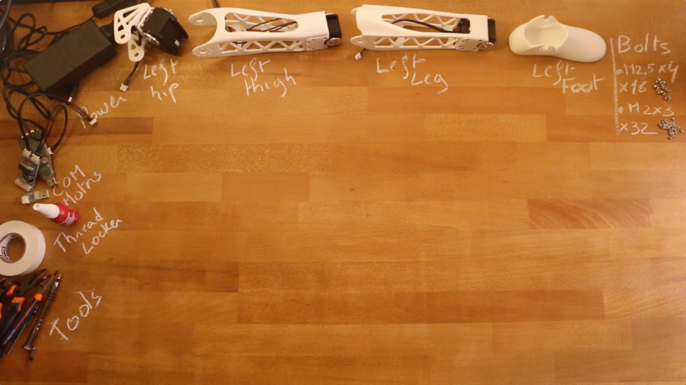

# Left leg assembly instructions

## 1- Build sub-assemblies

First you need to assemble several sub-assemblies:
- **1.1- [Left hip](./left_hip_assembly_instructions.md)**
- **1.2- [Left thigh](./left_thigh_assembly_instructions.md)**
- **1.3- [Left shin](./left_shin_assembly_instructions.md)**

## 2- Left leg assembly

- Preparation: 5 min
- Assembly: 20-25 min

### 2.1- Requirement:

**Sub-assemblies**
- Left hip
- Left thigh
- Left leg

**3D Printed parts**:
- Left foot

**Robotis parts:**
- 16x Bolts M2.5x4
- 32x Bolts M2x3

**Motor configuration:**
- 1x Alimentation 12V
- 1x SMPS2Dynamixel
- 1x USB2Dynamixel or USB2AX
- A computer...

### 2.2- Assembly instructions:

- **Step 1:** Ensure you have read [**this note**](//github.com/poppy-project/Robotis-library/blob/master/doc/en/robotis_tricks.md) before continuing to avoid the classic (and critical) traps when using Robotis Dynamixel actuators.
- **Step 2**: Click on the image below to display the video:

