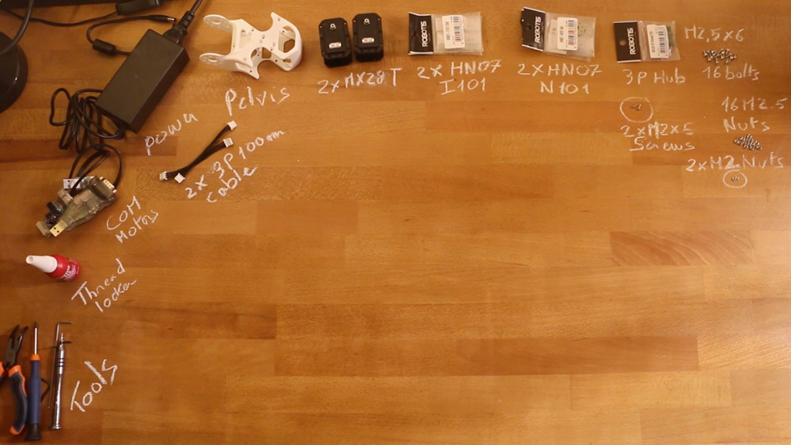

# Pelvis assembly instructions

- Preparation: 10 min
- Assembly: 25-30 min

## Requirement:

**3D Printed parts**:
- Pelvis

**Actuators:**
- 2x Robotis Dynamixel MX28-AT (or MX28-T)

**Cables**:
- 2x 3P 100mm

**Robotis parts:**
- 2x HN07-N101
- 2x HN07-I101
- Bioloid 3P hub
- 16x Nuts M2.5
- 16x Bolts M2.5x6
- 2x Nuts M2
- 2x Screws M2x5

**Motor configuration:**
- 1x Alimentation 12V
- 1x SMPS2Dynamixel
- 1x USB2Dynamixel or USB2AX
- A computer...

## Assembly instructions:

- **Step 1:** Ensure you have read [**this note**](//github.com/poppy-project/Robotis-library/blob/master/doc/en/robotis_tricks.md) before continuing to avoid the classic (and critical) traps when using Robotis Dynamixel actuators.
- **Step 2**: Click on the image below to display the video:

